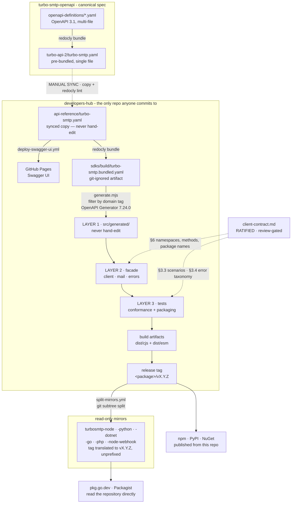
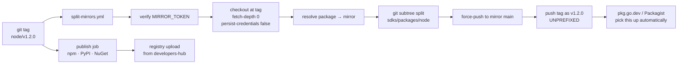

# SDK Pipeline — from canonical spec to published mirrors

How a change to the OpenAPI specification becomes five published SDKs. Strategy lives in
[`plan.md`](./plan.md), the executable checklist in [`TASKS.md`](./TASKS.md), the binding surface in
[`client-contract.md`](./client-contract.md), and the significant decisions in
[`docs/adr/`](./docs/adr/). This document describes the **operational flow** those files assume.

---

## The whole chain

## What happens on a release tag

Tags are `<package>/vX.Y.Z`, where the prefix is a package slug equal to its directory under
`sdks/packages/` (`node`, `python`, `csharp`, `go`, `php`, `node-webhook`), and versions are
**independent per publishable unit** — no lockstep family version, so no package's release waits on
another. The slug equals the language only for the five unified SDKs, because each is that
language's single unit; Node has two ([ADR-0009](docs/adr/0009-webhook-receiver-package.md)). The
two publication routes differ because two registries consume a repository rather than an uploaded
artifact.

The **tag translation is the point of the whole workflow**: Go resolves versions from root-module
tags, and Packagist reads `composer.json` from a repository root. A module in a subdirectory would
need `sdks/packages/go/v1.0.0`-style prefixed tags, and Packagist could not index it at all on the
free tier. See [ADR-0003](./docs/adr/0003-sdk-repository-topology.md).

## The three layers

| Layer | Produced by | Rule |
|---|---|---|
| **1 — generated core** | OpenAPI Generator, filtered per domain | Never hand-edited, so regeneration is always safe. Lives in an internal namespace and is not re-exported, so it cannot leak into the public surface |
| **2 — facade** | Hand-authored | Where features stop mapping 1:1 to endpoints: dual-auth hidden behind one credential object, region → host, recipient arrays → CSV, `text`→`content`, `replyTo`→`custom_headers`, base64 attachments, and the 64-bit `mid` read from raw response text because `JSON.parse` rounds past 2^53. Strictly bounded by the contract |
| **3 — tests** | Derived from the contract | Credential-free and offline via an injected `fetchApi` seam; plus packaging tests asserting every shipped artifact against an explicit export list |

## The contract is the load-bearing part

`client-contract.md` is what makes five independently-generated SDKs behave alike — the guarantee no
generator can provide. It is **ratified and review-gated: amend it before changing an SDK, never
after**. It fixes the namespaces and method shapes, the error taxonomy, auth and region behaviour,
the canonical package name per registry, and the priority tiers (P0 Mail → P1 Validation → P2 → P3).

## Automation status

| Stage | Today |
|---|---|
| Spec bundle + sync between repos | **manual** — see `CLAUDE.md` |
| Swagger UI deploy | automated (`deploy-swagger-ui.yml`) |
| Layer 1 generation | **manual** — `scripts/generate.mjs` |
| Build + tests | automated on `npm test` |
| Mirror split + tag translation | automated (`split-mirrors.yml`, proven 2026-08-06) |
| Regeneration on spec change | **not built** — `TASKS.md` 4.4 |
| Spec-drift guard | **not built** — 4.5 |
| Publish CI | **not built** — 4.6 |
| Shared conformance matrix · mock server · live smoke | **not built** — 4.1 / 4.2 / 4.3 |

The loop from *spec change* to *regenerated SDKs* is therefore still hand-driven. Closing it is the
main remaining infrastructure work, and its shape is already settled: **one PR, one CI run, all five
languages** — never cross-repo, because no single run would otherwise ever see all five facades.

## Current state

Node runs the entire chain except the final hop; only `npm publish` is blocked. Python, C#, Go and
PHP have everything upstream of Layer 1 ready — generation is one command each — but none are
started.
